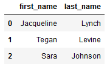

# NoSQL Data Modeling with Apache Cassandra
<p align="center">
  
</p>

### Project from Udacity Data Engineering nanodegree
This project places myself as a Data Engineer for a fictional music streaming company called Sparkify. They have raw CSV metadata but no easy way to query the data.  
The goal is to design and create a NoSQL database and ETL pipeline optimized to answer **3 specific questions.**

### Dataset
The dataset is user songplay log files in CSV format generated by this [event simulator](https://github.com/Interana/eventsim). These simulate activity logs from a music streaming app based on specified configurations.  

### Combined Dataset after denormalization
The data was denormalized to optimize query performance by avoiding costly joins (done by adding redundant data to the table). It does mean more storage, but the improved query performance outweights additional storage costs.  
The image below is a snapshot of what the combined denormalized data looks like.  
  

### Questions
From the above data, 3 tables were created specifically to answer the following questions (queries):  

1. Give me the artist, song title and song's length in the music app history that was heard during  sessionId = 338, and itemInSession  = 4  
2. Give me only the following: name of artist, song (sorted by itemInSession) and user (first and last name) for userid = 10, sessionid = 182  
3. Give me every user name (first and last) in my music app history who listened to the song 'All Hands Against His Own'

### Instructions
Follow **notebooks/nosql_cassandra.ipynb** which takes you through the following steps:
- Combine the CSV files from **event_data** into the denormalized table *event_datafile_new.csv*
- Create database connection to Cassandra (on your local machine)
- Create keyspace in Cassandra (called udacity)
- Creates the 3 tables designed to run the above 3 queries (explanation for table design is in the notebook as comments)
- Inserts the data into the tables
- Runs the queries and returns the results as Pandas dataframes

### Extra work completed  
- Returned the queries as Pandas dataframes instead of unformatted text

### Sample query (Query 3)
*Give me every user name (first and last) in my music app history who listened to the song 'All Hands Against His Own'*
```
SELECT first_name, last_name            
FROM user_info_by_song
WHERE song = 'All Hands Against His Own'
```
  

